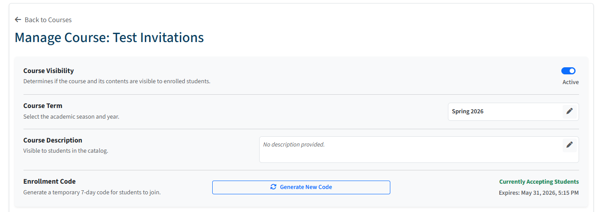
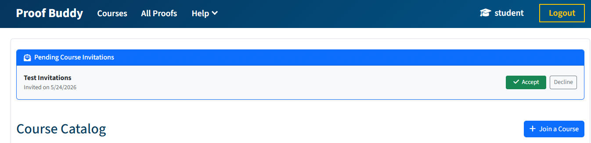

# User Guide: Course & Assignment Management

Welcome to the Course and Assignment system. This guide walks instructors and students through the functional end-to-end workflows of the dashboard portal.

---

## 1. Instructor Operations

### 1.1 Creating a Course

1. Navigate to the courses page.
2. Select **Create New Course**.
3. Provide a unique course name. You can optionally select to generate a join code immediately.

### 1.2 Modifying the Course

Each course has data that can be altered. Upon initial creation, the course visibility will be set to false, the term will be set to the current quarter and year, and the description will be blank.

At bare minimum, the course must be marked **Active** in the **Course Visibility** section to allow students to view the course and work on assignments. The Course Term may be set to any of the four seasons and a year. The course description is plain text. The Enrollment Code has a button to generate a new code and shows when the current code will expire if it is still active.

### 1.3 Enrolling Students (Invitations & Codes)

Instructors can build a class roster using two separate methods:

* **Direct Invitation:** From the courses page as an instructor, click on the **Manage** button for one of your courses. At the bottom of the page is a section labeled **Add Student Manually**. Enter a student username or email in this text input and click **Add Student**. If a matching non-instructor account exists, it generates a pending invitation request. If there is more than one student with the email provided, the list of conflicting students will be provided to select from.
* **Dynamic Join Codes:** Instructors can generate a secure 8-character access phrase within the course settings view. This code is active for **7 days**. Students input this code on their courses page to instantly join the roster.

### 1.4 Assignment Staging & Student Progress Tracking

* **Creating Assignments:** Select **Add Assignment** from inside a course management page. Give it a name, select a deadline date, and attach target proof models directly from your personal proof Library. Proofs can be either Equational Reasoning or Induction. When you create the assignment, the current state of that proof is copied, ensuring students who work on the assignment will all work on the same proof.
* **Editing Assignments:** Select the pen button in the **Action** column of the **Assignments** table. From the window that opens, change the name of the assignment, set the date, or modify the selected proofs. Reordering proofs is always permitted, as well as adding new proofs. Removing or renaming a proof is only possible if no student has begun working on that specific proof to ensure each student works on the same proofs.
* **Copying Assignments:** Any assignment can be copied to one of your own courses. Outside of copying the exact state of the assignment, you may also add more proofs, rename current proofs, and remove proofs. There is no restriction on the actions performed here because the assignment will not modify the source assignment in any way. Any proof that is carried over in a copy will copy the version that was on the original assignment. If that proof is no longer desired, it should be removed by clicking the trash can on the **Selected Proofs** table and selecting the latest version from your list.
  * An assignment may also be copied to another instructor's course in the form of an invitation. If the recipient accepts, they will get a copy of the proofs attached to their personal library of proofs, and the assignment will be added to the course that the request was sent to. Assignment shares are only possible between existing courses. If an instructor does not have a course, they cannot send or recieve an assignment.
* **The Progress Matrix:** Click on the eyeball icon in the **Action** column of the assignment you wish to view student progress. A winodw will open showing a mapping of each student to their progress on each proof in the assignment (`Not Started`, `In Progress`, `Completed`, or `Completed (Late)`). Clicking on the status will open up the student's proof (if it is not in `Not Started` state) with a banner to show which student owns the proof.

---

## 2. Student Operations

### 2.1 Joining a Classroom

* **Accepting Requests:** Active institutional invites will register on the main student summary window automatically. Click **Accept** to instantly join the corresponding roster. Clicking decline will set the status to rejected and provide feedback on the rejection back to the course owner when they view the course.

* **Entering Join Codes:** Click **Join a Course**, paste the active token distributed by your instructor, and submit to enroll.

### 2.2 Interacting with Assignments

1. Select a course to view the list of assignments.
2. Click on an assignment to expand it to view the proofs.
3. Clicking **Start Assignment** initiates a background copy operation, creating a personal version of the proof to complete for the assignment.
4. Complete the proof to update the submission status to *Completed*.

---

## 3. Implemented Enforcements (System Guardrails)

To prevent security cross-contamination, the interface strictly applies the following structural guardrails:

* **Role Lockouts:** Student profiles cannot view, modify, or interact with course generation workflows, invitation tables, or progress grids.
* **Instructor Isolation:** Instructors can only delete or edit assignment items attached to courses they personally own.
* **Status Freeze:** Student workspace copies automatically flag submissions as `late` if completion markers trigger past the assignment's explicit date threshold. Assignment completion is marked by the first time the completion check passes. This is put in place to prevent re-checking completion from marking an already completed proof as late.
