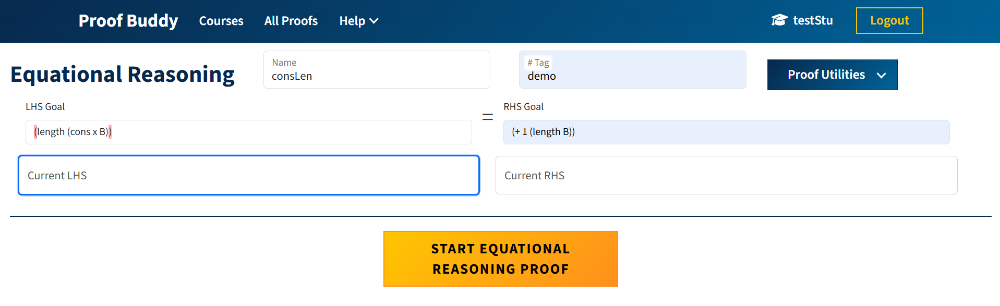
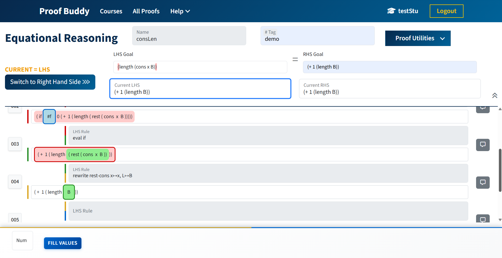
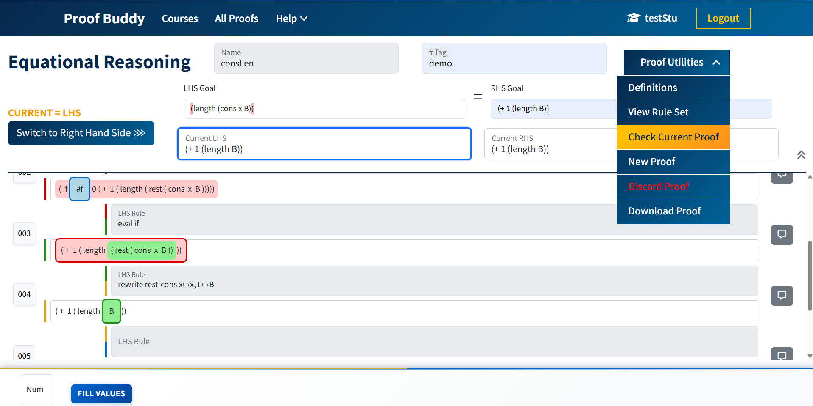
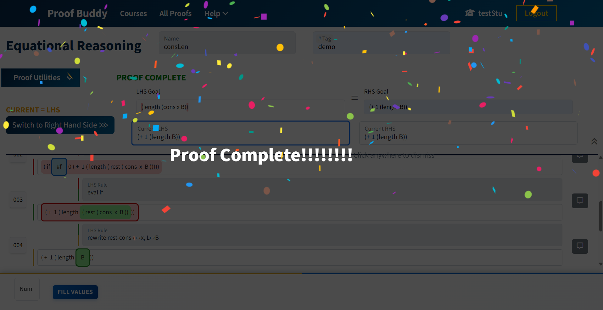
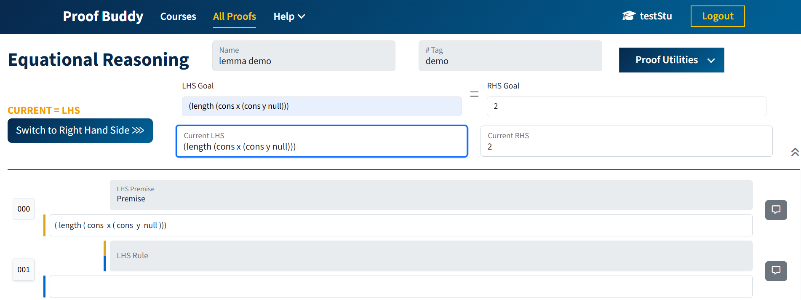
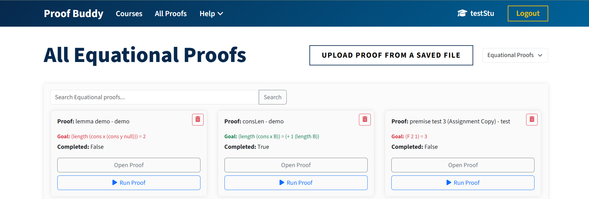
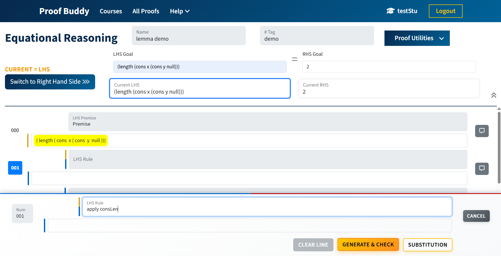
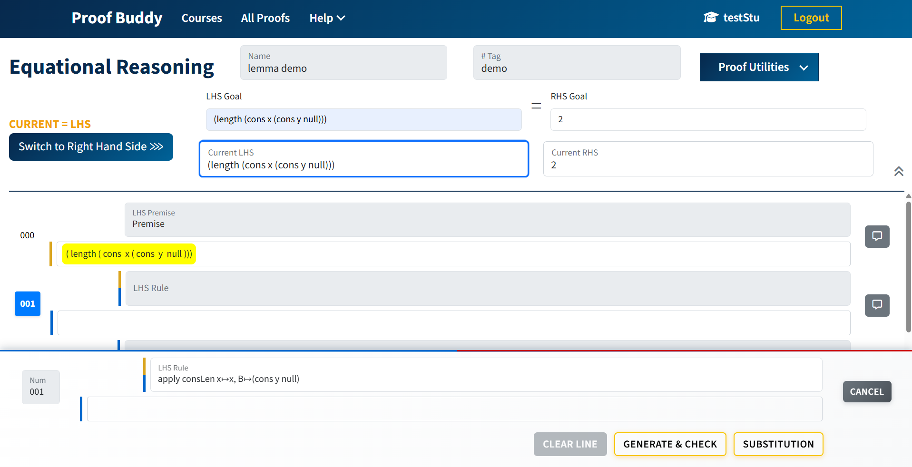
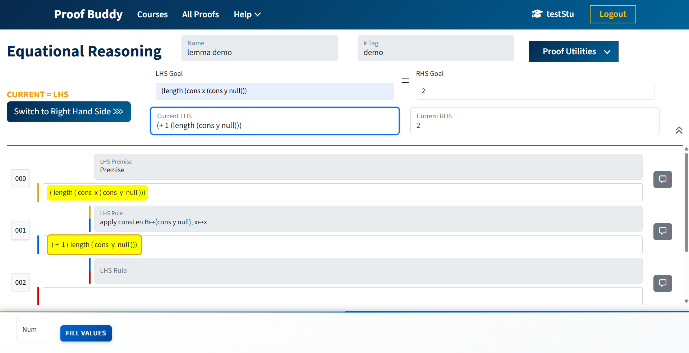

# Proof Buddy — Lemma Documentation

## 1. Use Instructions
1. Create a new proof using the name of the Lemma
    
2. Complete each line of the proof until LHS is equal to RHS
    
3. Navigate to the `Check Proof Complete` button in the `Proof Utilities` dropdown in the top right corner 
    - **Once Proof Buddy verifies that the proof is complete, it can now be called upon in other proofs as a lemma/proven theorem.**
    
    
4. To apply a lemma, use the "**apply**" keyword followed by the name of the lemma
    - If you forget the name of a Lemma while in a proof, clicking "All Proof" to see list of all lemma, then go back to where you left off in the proof
        
        
    - **For example**: if the lemma is named "consLen" the rule entered should be `apply consLen`
        - **On High Support**: parameter mapping is optional, but if given it must be correct (i.e.`apply consLen x↦x, B↦'(cons y null)`)
        - **On Low Support**: parameter mapping must be typed in manually and must be correct (i.e.`apply consLen x↦x, B↦'(cons y null)`)
    - Ensure that the highlighted expression matches what the premise of the lemma
        - Without parameter mapping inputted 
        
        - With parameter mapping inputted
        
5. To finish the application of the lemma, click `Generate & Check` button, which will validate the application
    - If valid, the next line in the proof will be available. Otherwise, there will be a toast message stating the error
    

<mark>*It should be noted that any completed proofs can be applied as a lemma</mark>

## 2. Data Model
Unlike other rule applications or evaluations in Proof Buddy, lemmas do not have a Rule Type defined in `ERRuleset.py` and there is no separate `Lemma` model. There is no dedicated table for lemmas.

Lemmas are not built-in rules (e.g. `first-cons`) as they are user-created, user-specific, and stored in the database, rather than being hard-coded.

**Lemmas are sourced from existing proof models:**
- For a proof to be eligible to be used a lemma, it must have:
    - `is_complete=True`
    - `is_active=True`
    - have a non-null `name` field
- The `EquationalProof` model is found in `/django_server/equational_reasoning_api/models.py`
- The `InductionProof` model is found in `/django_server/induction_api/models.py`

## 3. Lemma Lookup
Uses `_lookup_lemma()`, which is defined in both `equational_reasoning_api/views.py` and `induction_api/views.py`. 

When it is given a lemma name and user, it queries the database for the **most recent completed proof** with that name and returns `(premise_str, conclusion_str, error)`.

## 4. Core Rule Class
The core rule class is called `LemmaRule` found iin `ERRuleset.py`

`LemmaRule` extends the abstract `Rule` class and holds:
- `premise_tree` / `conclusion_tree` — parsed ASTs for LHS and RHS
- `param_names` — free variables detected in the premise 

**`isApplicable(targetNode, rawParams)`** validates:
1. Correct number of `name=value` param assignments
2. Param names match the lemma's free vars
3. Each value parses to a valid AST node
4. Substituting params into the premise matches the target node structurally

**`insertSubstitution(targetNode)`** deep-copies the conclusion and substitutes all param bindings, returning the
rewritten node.

## 5. Pure Engine Utilities
Three stateless functions (no Django ORM) in `expression_tree/LemmaApplicator.py`:
| Function Name | Purpose |
| ------------- | ------- |
| `extract_free_vars()` | finds alphabetic leaves not in the ruleset (free parameters) |
| `build_lemma_rule()` | parses premise/conclusion and returns a `LemmaRule` object |
| `validate_lemma_application()` | full validation and application pipeline |

## 6. Dynamic Injection During Proof Steps
### 6.1 Process
When a student applies rule string `"apply <lemmaName> x=a, y=b"`, both the equational and induction proof engines:
1. Detect the `"apply"` prefix
2. Call `_lookup_lemma()` to fetch premise/conclusion from the DB
3. Call `build_lemma_rule()` to construct a `LemmaRule`
4. Temporarily inject it into `ruleSet['apply']`
5. Run normal rule application
6. Remove it from the ruleset immediately after

This temporary injection keeps rulesets clean and ensures lemmas don't persist across unrelated steps.

### 6.2 Parameter Inference
`_infer_params_for_rule()` found in `ERProofEngine.py` allows for a "high-support" mode.

In the "high-support" mode, the function walks thr premise tree and the highlighted target node in parallel, unifying free variables automatically.
<br>
As a result, students do no have to input `x=..., y=...` when applying a lemma.

## 7. API
There are no seperate lemma-only routes, it's integrated into existing rule endpoints:
| Endpoint | Purpose|
| -------- | ------ |
| `POST /api/equational/apply-rule` | Apply any rule, including lemmas, to an equational proof|
| `POST /api/induction/apply-rule` | Apply any rule, including lemmas, to an induction proof |
| `GET /api/equation/list` | List proofs, which can be browsed as available lemmas|

## 8. Frontend
Currently has minimal dedicated UI.

`CreateProof.js` has "Lemmas Allowed?" checkbox, which is a placeholder for future enforcement. 

Students invoke lemmas by typing the rule string directly. There is currently no dedicated lemma-picker dropdown.

## 9. Lifecycle Summary

1. **Student completes and names a proof**
   - Stored as `EquationalProof` / `InductionProof`
   - Marked with `is_complete=True`

2. **Student applies a lemma**

   ```text
   apply myLemma x=a
   ```
3. **Lemma is resolved and injected**
    ```text
    _lookup_lemma()
        ↓
    build_lemma_rule()
        ↓
    inject into ruleSet
    ```
4. **Lemma rule executes**
    ```text
    LemmaRule.isApplicable()
        ↓
    insertSubstitution()
    ```
5. **Result returned**
    ```text
    result node is returned
        ↓
    lemma removed from the ruleSet
    ```
