## INSTRUCTOR USER GUIDE

The proof editor is the same as for students. For writing steps, rules, definitions, and induction, see [STUDENT USER GUIDE](STUDENT_USER_GUIDE.md).

This guide covers instructor accounts, authoring scaffolded problems, courses, assignments, and reviewing student work.

### Welcome

To access Proof Buddy, visit [proofbuddy.net](http://proofbuddy.net)

### 1. Account and Home

#### 1.1 To create an (instructor) account:

1. Click on the **Sign Up** button
  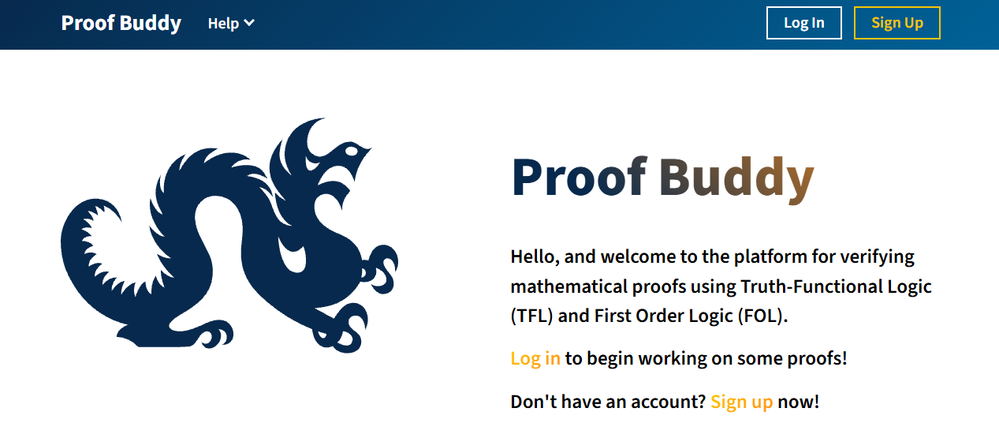
2. Choose the **Instructor** account option
  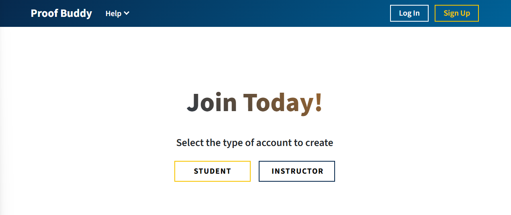
3. Click **Sign Up** button after filling out **Username**, **Email**, **Password**, and **Confirm Password** fields
  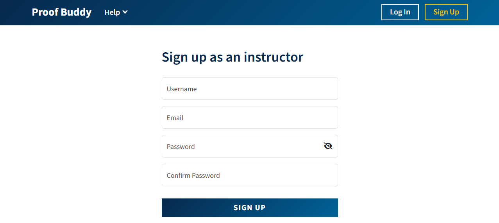

Student and instructor accounts are chosen at sign up and do not switch later.

#### 1.2 Logging In:

1. Click on the **Login** button
2. Fill in **Username** and **Password** fields, then click **Login**
  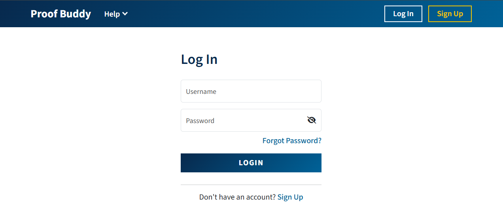

If you've forgotten your password, you may reset it through **Forgot Password**.
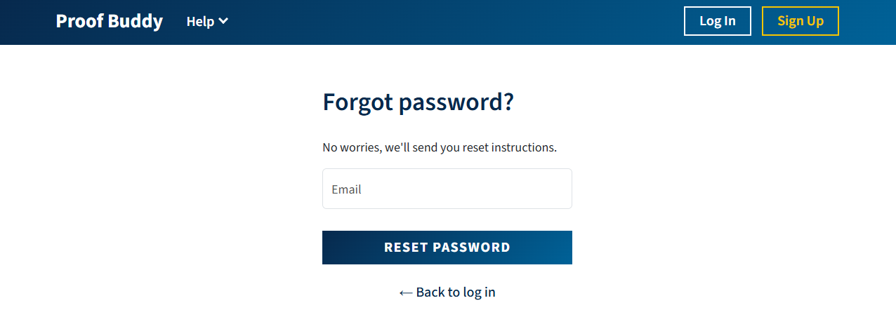

#### 1.3 Account Home:

Once logged in, you will see **Proof Buddy**, **Courses**, **All Proofs**, and **Help** in the Header. By default, you will be on the home page upon login (which can also be reached by clicking **Proof Buddy** in the Header).

- **Courses**: where you create and manage courses you own, or join another instructor's course as an observer
- **All Proofs**: your proof library. Proofs you attach to assignments are copied from here

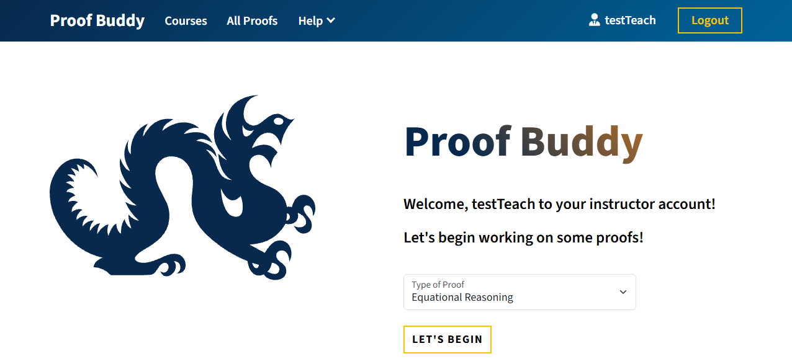

Create a new proof by selecting Equational Reasoning or Induction in the **Type of Proof** dropdown and clicking **Let's Begin**. How to write the proof itself is in the [STUDENT USER GUIDE](STUDENT_USER_GUIDE.md#2-starting-first-equational-proof).

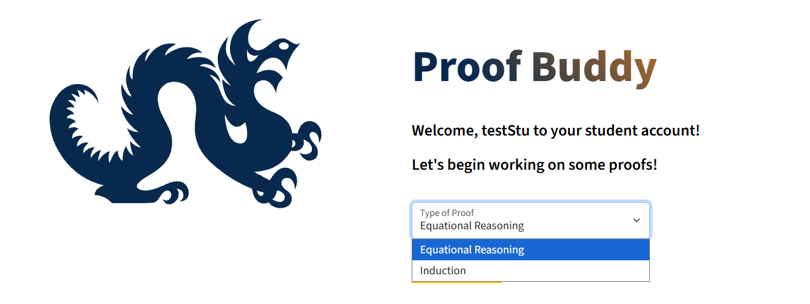

If you open a course you do not own, you see the student-style (observer) view, not the manage page.

### 2. Author a Problem

Write the full solution first, then hide the parts students should fill in, then set support. Attach that snapshot to an assignment (see [§4](#4-courses-rosters-and-assignments)).

How to enter goals, apply rules, use definitions, and finish a proof: [STUDENT USER GUIDE §2–§7](STUDENT_USER_GUIDE.md#2-starting-first-equational-proof).

#### 2.1 Hide lines (eye icons)

On each proof line, instructors see eye buttons that students do not:

- **Hide / Unhide Rule**: students must type the justification (for example `eval +`)
- **Hide / Unhide Expression**: students must type the expression on that line
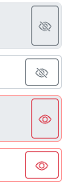

Click the eye so the field is hidden before you assign the proof. Students fill the blank and click **Generate & Check**. The step is accepted only if it matches what you stored.

You can still **Check Current Proof** as an instructor while lines are hidden. Students cannot mark the proof complete until every hidden field is filled correctly.

#### 2.2 Hide a definition body

1. Open **Proof Utilities** → **Definitions**
  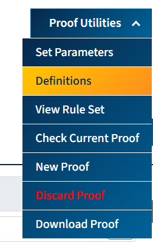
2. Create or edit a definition
  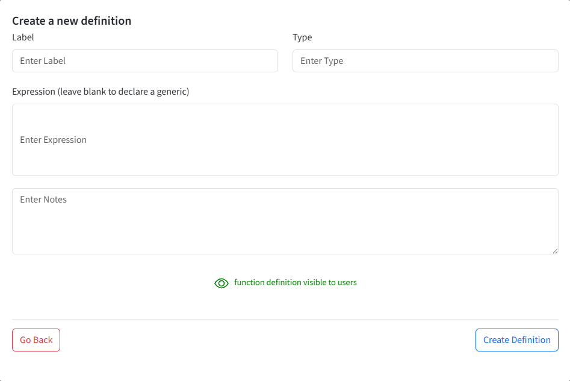
3. Use the eye next to the expression to hide the body
  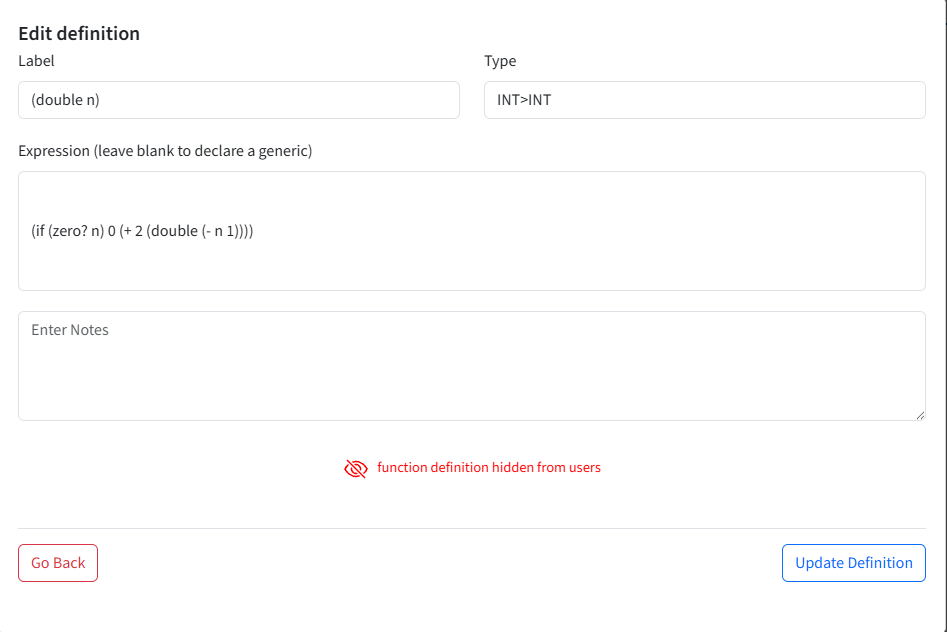

Students see that the definition exists but must reconstruct the hidden expression. Built-in definitions (`length`, `append`) cannot be edited or deleted; you can still enable or disable them on the proof.

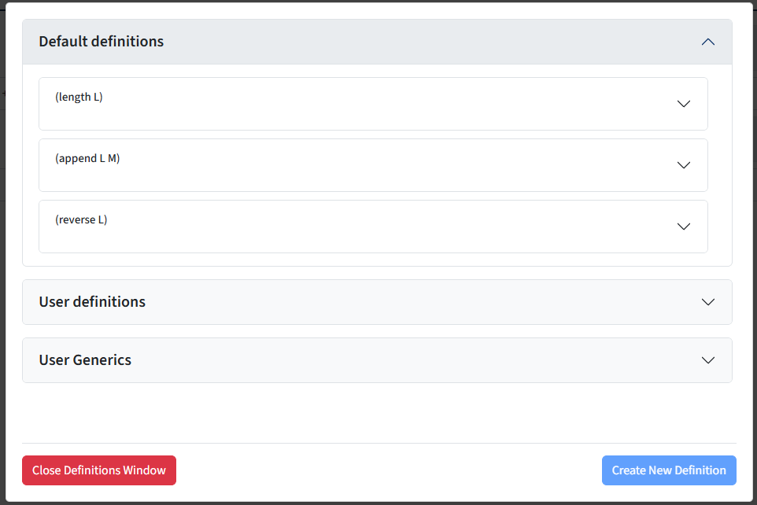

#### 2.3 Set Parameters

**Set Parameters** is in **Proof Utilities** and is instructor-only.

1. Open **Proof Utilities**
2. Click **Set Parameters**
3. Choose **Low** or **High** per row (or **ALL** to set every row at once)
4. Save

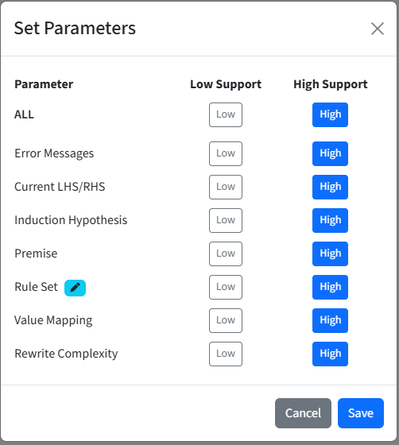

What students see:

- **Error Messages**: Low: generic “your latest command contains an error”. High: targeted hint
- **Current LHS/RHS**: Low: those fields are not shown. High: they stay visible
- **Induction Hypothesis**: Low: student types it; only under **Proof Utilities** → **Show IH**. High: autogenerated and visible
- **Premise**: Low: student types it. High: autogenerated
- **Rule Set**: Low: full list. High: only the rules you allow (click the pen badge to pick eval/rewrite rules)
  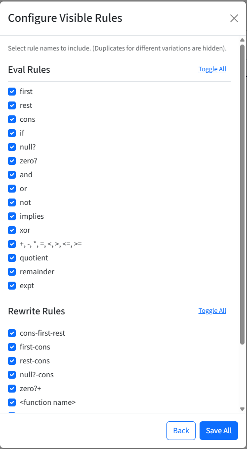
- **Value Mapping**: Low: student types `x↦…` when applying a lemma or definition. High: mapping is inferred
- **Rewrite Complexity**: extra support row on the same screen

Rules already used in the proof stay locked on in the customized rule set. You cannot hide a rule the solution already depends on.

After you hide lines and set parameters, run **Check Current Proof** yourself so the library copy is complete before you attach it to an assignment.

### 3. Lemmas

Lemmas work the same way as for students. Complete and name a proof, then later type `apply <proof name>` on a highlighted matching expression. Full walkthrough: [Lemma Guide: Use Instructions](../Lemma/LEMMA.md#1-use-instructions) and [STUDENT USER GUIDE §5](STUDENT_USER_GUIDE.md#5-lemmas).

If an assignment requires a lemma:

- Finish that lemma in your library first
- Keep **High Support** if you want mapping inferred; use **Low Support** if students must type `x↦…`
- Attach both the lemma proof (if they need to complete it) and the proof that uses `apply`, or make sure the lemma is already a completed proof they can look up under **All Proofs** after they start the assignment copy

### 4. Courses, Rosters, and Assignments

Classroom setup details: [Course User Instructions: Instructor Operations](../Courses/COURSE_USER_INSTRUCTIONS.md#1-instructor-operations).

**Recommended order:** finish the solution proof → hide lines and set parameters → attach it from your library → mark the course **Active** → share a join code (codes last **7 days**).

#### 4.1 Create a course

1. Click **Courses** in the header
  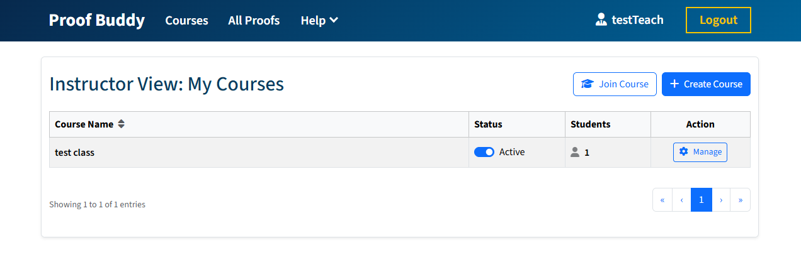
2. Click **Create Course**
3. Provide a unique course name. You can optionally generate a join code immediately
  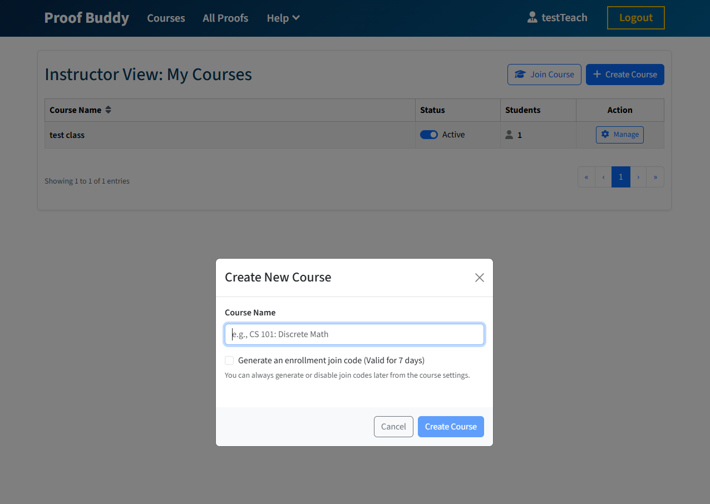

New courses start inactive. Students cannot see them until **Course Visibility** is **Active**.

You can also click **Join Course** and paste another instructor's code. That opens their course in the student-style observer view, not **Manage Course**.

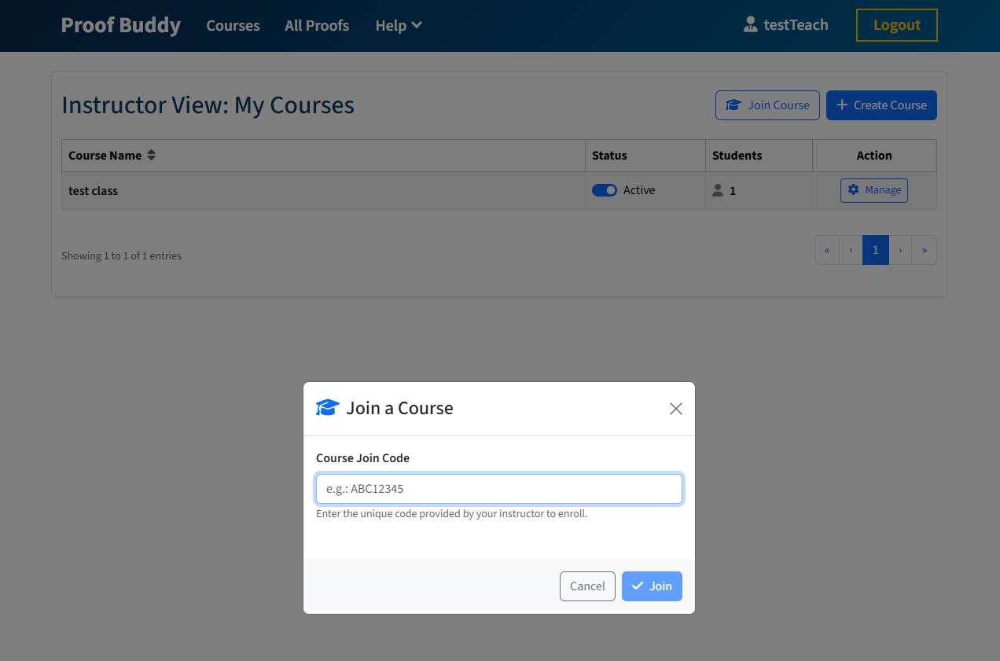

#### 4.2 Manage a course you own

Open the course to reach **Manage Course**.

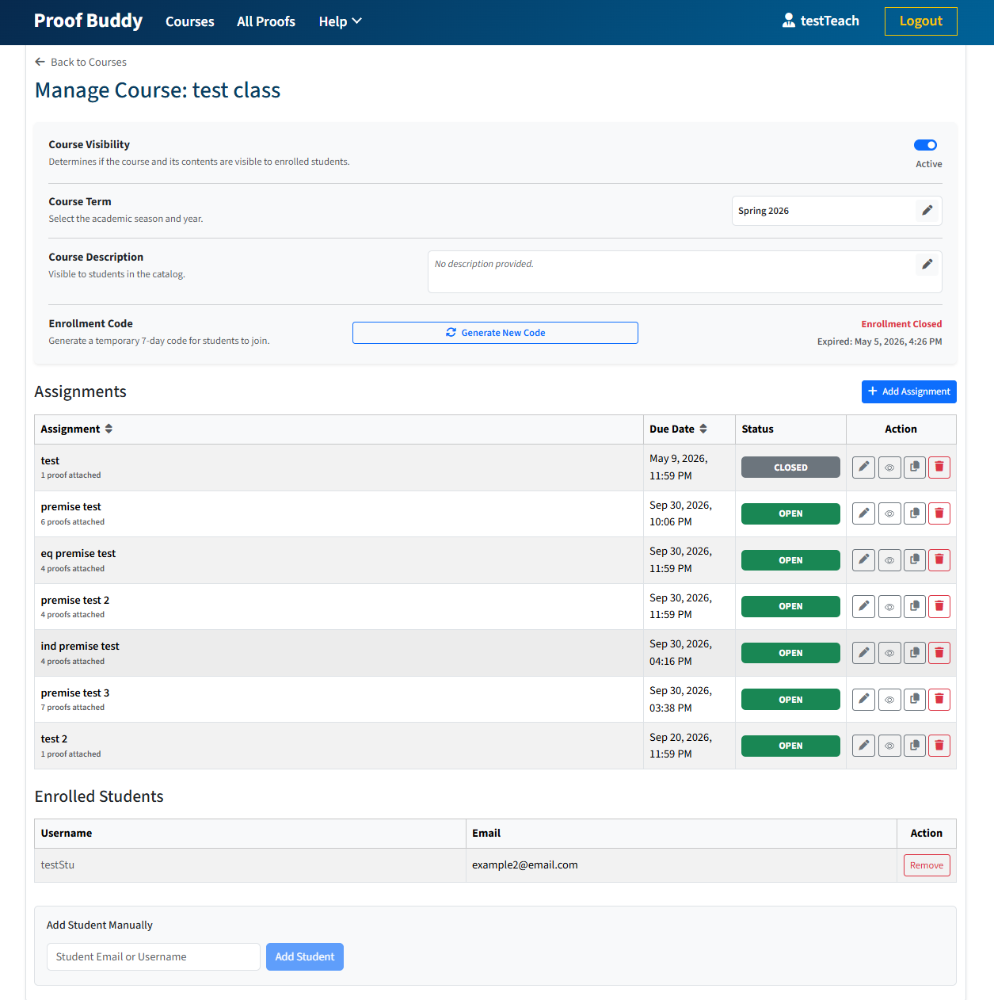

- Turn **Course Visibility** to **Active** so students can enroll and work
- Set the term (season and year) and description
- Click **Generate New Code** for an 8-character join code. Save it when it appears; it is shown once. The code is active for **7 days**
  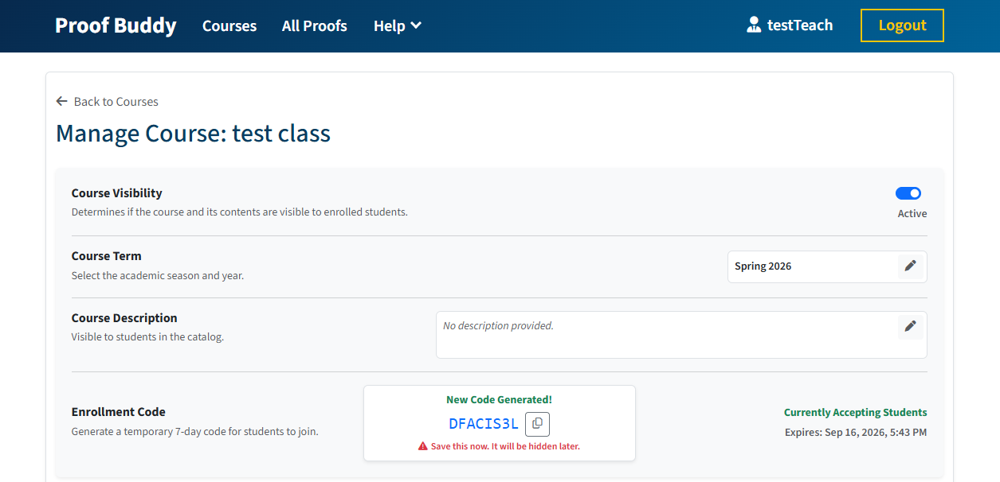

#### 4.3 Roster

Two ways to enroll students (see also [Course User Instructions §1.3](../Courses/COURSE_USER_INSTRUCTIONS.md#13-enrolling-students-invitations--codes)):

- **Join code**: give students the code; they enter it under **Join a Course**
- **Add Student Manually**: enter a username or email and click **Add Student**. If more than one student matches, pick the correct account. The student must **Accept** the invitation

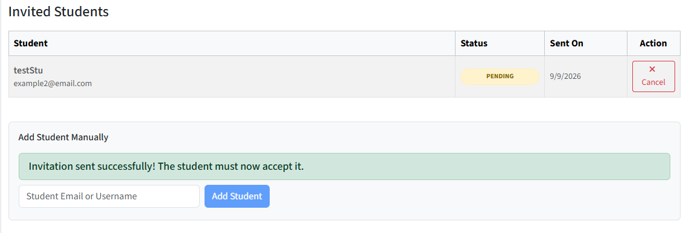

You can remove a student from the roster on the same page.

#### 4.4 Create an assignment

1. On **Manage Course**, click **Add Assignment**
2. Give it a name and a due date
  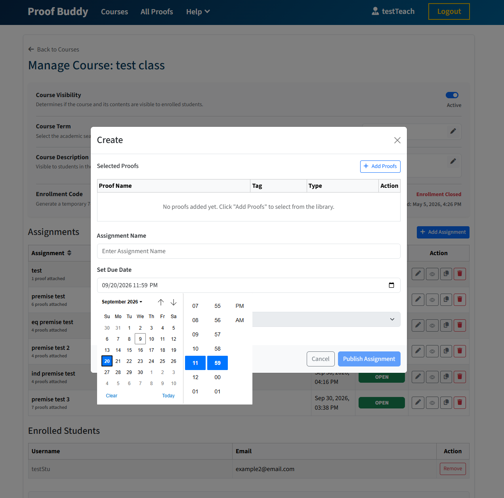
3. Attach proofs from your library (equational or induction)
  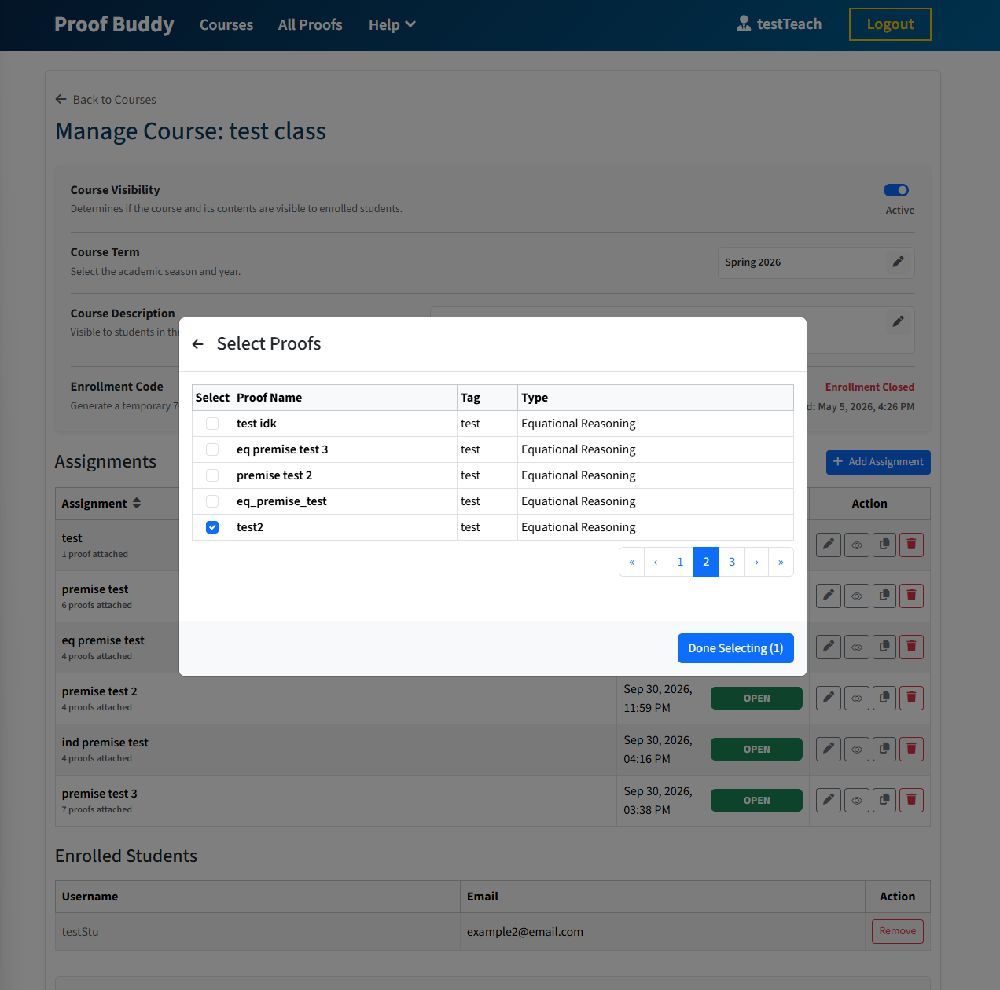
4. Save when the form is filled
  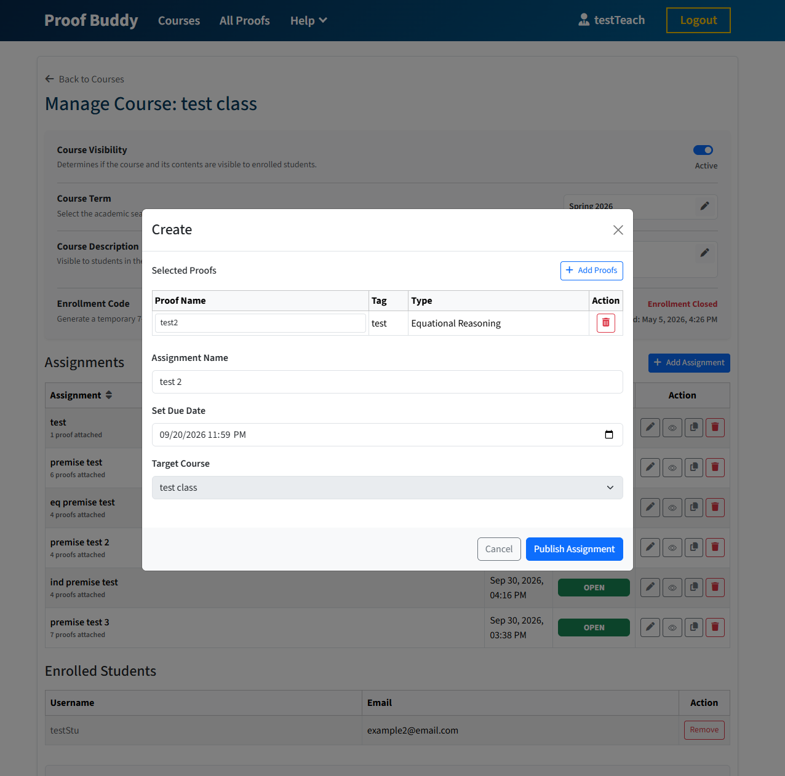

The assignment stores a **copy of the proof as it is now** (hidden lines, definitions, and parameters included). Editing the library proof later does not change copies already attached.

**Edit** (pen icon): you can always rename the assignment, change the due date, reorder proofs, and add proofs. You can remove or rename a proof only if no student has started that proof.

### 5. Watch and Comment

On the assignment **Action** column, click the eye icon (**View Student Progress**).

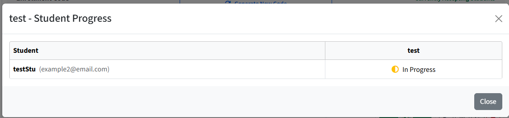

The progress matrix maps each student to each proof:

- **Not Started**
- **In Progress**
- **Completed**
- **Completed (Late)**

Click a status that is not **Not Started** to open that student's proof. A banner shows whose proof it is.

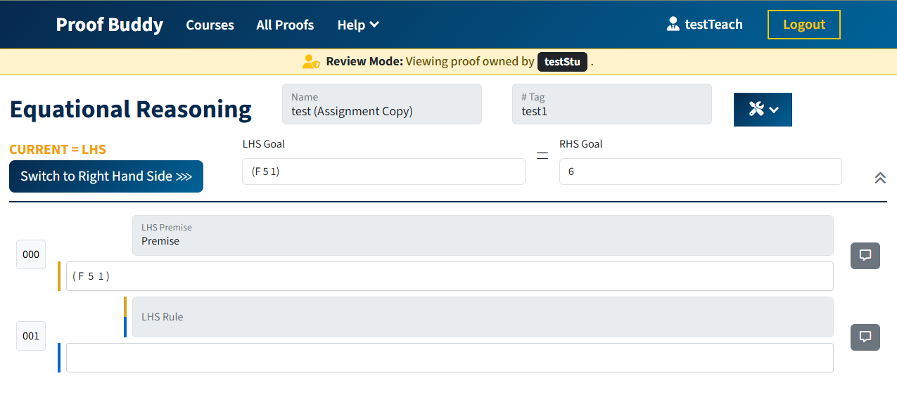

On each line, the comment (message) button opens two boxes. You edit **Instructor Comment**. Students can only edit **Student Comment**.

A filled (blue) message icon means that line already has a comment. An outline (gray) icon means it does not.

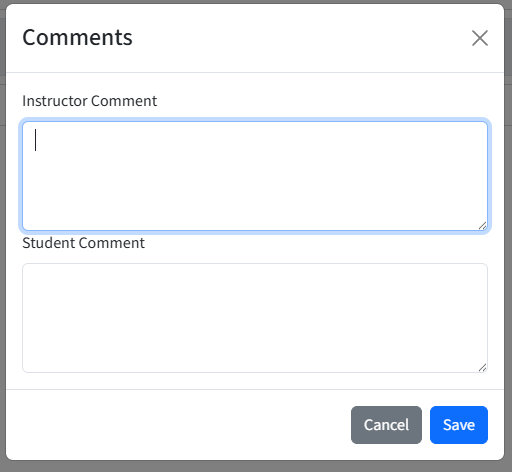

Completion is stored the first time **Check Current Proof** succeeds on the student's copy. If that is after the due date, it is **late**. Checking again later does not change that. See [Course User Instructions §3](../Courses/COURSE_USER_INSTRUCTIONS.md#3-implemented-enforcements-system-guardrails).

### 6. Copy and Share Assignments

Details: [Course User Instructions §1.4](../Courses/COURSE_USER_INSTRUCTIONS.md#14-assignment-staging--student-progress-tracking).

On an assignment, click the copy icon.

- **Copy to one of your courses**: you may add, rename, or remove proofs freely. The new assignment does not change the original. Proofs come from the version that was on the source assignment
  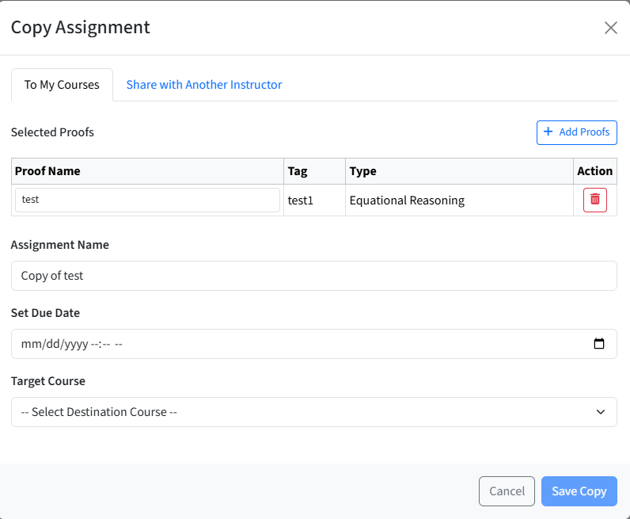
- **Share to another instructor**: they receive an invitation. If they accept, the proofs are copied into their library and the assignment is added to the course you sent it to
  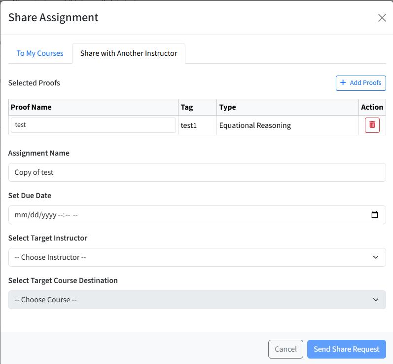

Incoming and sent shares appear on **Manage Course** under **Shared Assignment Packages** (**Incoming Packages** / **Sent Tracking**). Accept or decline incoming packages there.

Both instructors must already have a course. You cannot send or receive an assignment share if the other instructor has no course.

### 7. FAQ

**Students cannot join or cannot see the course.**
- Mark **Course Visibility** **Active**, and give them a join code that has not expired (7 days). They must use a **student** account.

**Students have different proofs from each other.**
- The assignment copies the proof at assign/edit time. Change the library copy, then add that version to a new assignment (or to an assignment where nobody has started that proof yet).

**I cannot remove a proof from an assignment.**
- A student has already started it. You can still reorder and add proofs.

**Share failed.**
- The other instructor needs at least one course. Shares only go between existing courses.

**I opened a colleague's course and cannot manage it.**
- That is observer mode (student-style view). Only the owner sees **Manage Course**.

**Students cannot check the proof complete.**
- Something is still hidden, or LHS does not yet equal RHS. Fill-in steps must match the stored solution.

**I do not see Set Parameters.**
- That item is instructor-only, in **Proof Utilities**. Students never see it. Set parameters on the library proof *before* you attach it to an assignment, so every student copy gets the same settings.

**I signed up as a student by mistake.**
- Role does not switch. Create an instructor account from **Sign Up** → **Instructor**.
