## STUDENT USER GUIDE

For Instructors, please see [INSTRUCTOR USER GUIDE](INSTRUCTOR_USER_GUIDE.md)

### Welcome

This guide covers the creation of and/or explanation of accounts, proofs, courses, and assignments. 

To access Proof Buddy, visit [proofbuddy.net](http://proofbuddy.net)

### 1. Account and Home

#### 1.1 To create a (student) account:

1. Click on the **Sign Up** button
  
2. Choose the **Student** account option
  
3. Click **Sign Up** button after filling out **Username**, **Email**, **Password**, and **Confirm Password** fields
  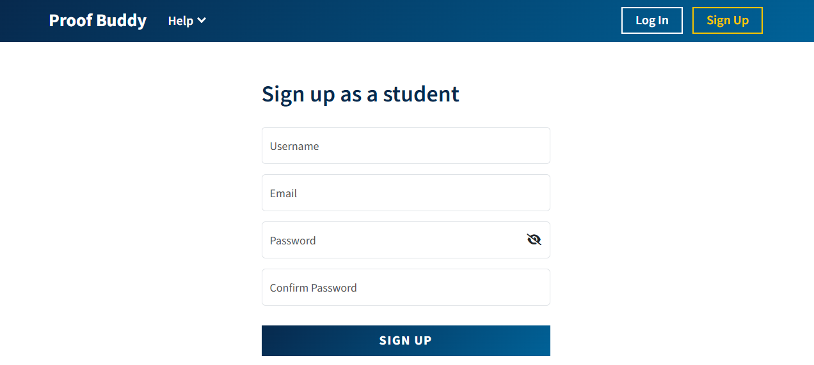

#### 1.2 Logging In:

1. Click on the **Login** button
2. Fill in **Username** and **Password** fields, then click **Login**
  

If you've forgotten you're password, you may reset it through **Forgot Password**

#### 1.3 Account Home:
Once logged in, you will see **Proof Buddy**, **Courses**, **All Proofs**, and **Help** in the Header.  By default, you will be on the home page upon login (which and also be reached by clicking **Proof Buddy** in the Header).
- **Courses**: where you access all courses, course invites, and assignments
- **All Proofs**: where you access all your saved proofs, including proofs assigned by instructors.

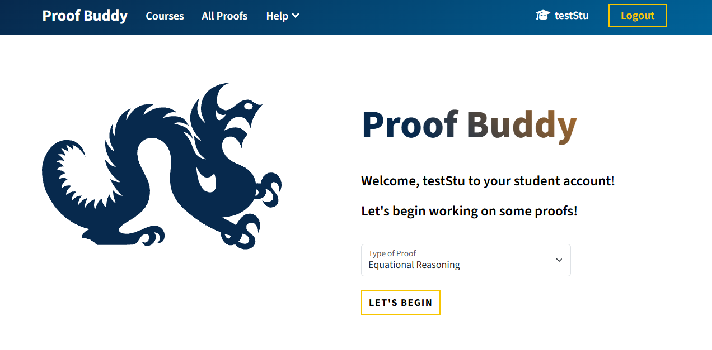

The home page is also you will see the option to create a new proof. This is accomplished by selecting Equational Reasoning or Induction in the "Type of Proof" dropdown and the **Let's Begin** button.

### 2. Starting First Equational Proof

From the home page, choose **Equational Reasoning** in the **Type of Proof** dropdown and click **Let's Begin**.

This walkthrough proves `(+ 1 2) = 3`. The same steps are used for any equational proof: fill in the start form, apply rules until the two sides match, then check that the proof is complete.

#### 2.1 Fill in the start form

1. Enter a **Name** (for example `Simple Addition`) and a **# Tag**
2. Enter the **LHS Goal**: `(+ 1 2)`
3. Enter the **RHS Goal**: `3`

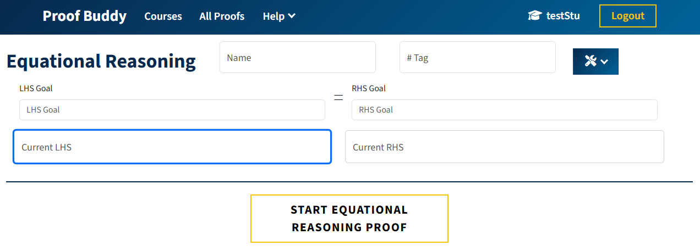

To Begin the Proof, click **Start Equational Reasoning Proof**
* If there are no naming conflicts, click **Start Proof**
  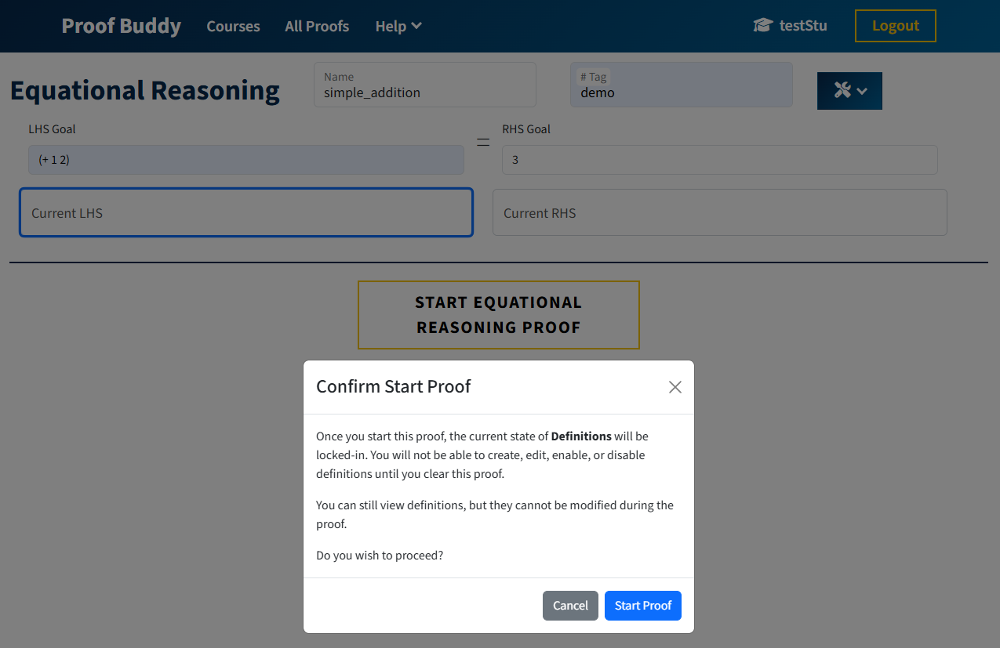
* If naming conflict occurs, a confirm overwrite popup will appear. Determine if you wish to overwrite the existing proof of the same name and select the appropriate button.
  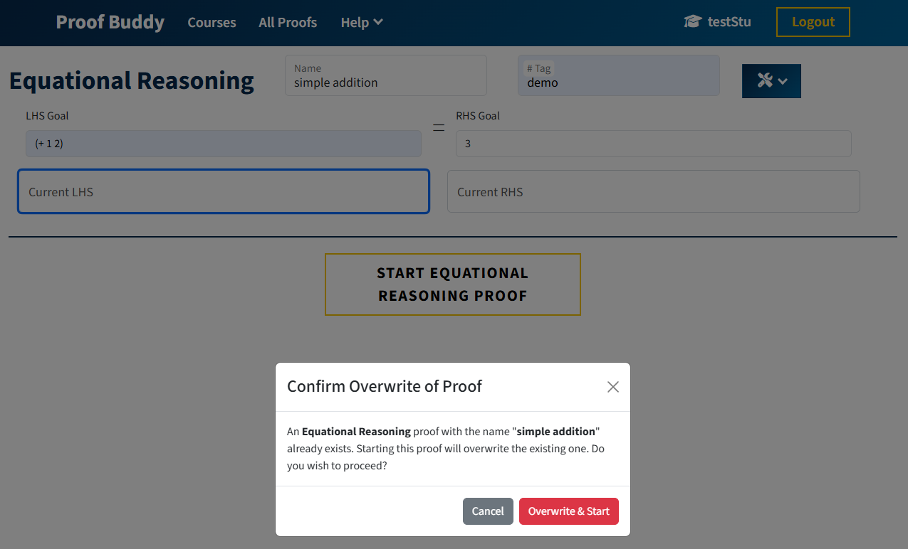

LHS and RHS goals cannot be empty, and they cannot be identical when you start. After the proof starts, the name, tag, and goals are locked.

#### 2.2 Apply a rule

The proof has two sides, **LHS** and **RHS**. **CURRENT** shows which side you are editing. Line `000` is the premise (the original goal for that side). You cannot clear the premise.

1. Click the expression (or use the arrow keys) so the part you want to change is highlighted. For this example, highlight `(+ 1 2)`
  - **Down Arrow**: highlight the nested/child/sub expression
  - **Up Arrow**: highlight parent expression
  - **Left/Right Arrow**: highlight different parts of the expression at the same "level"
2. In the rule box at the bottom, type `eval +`
  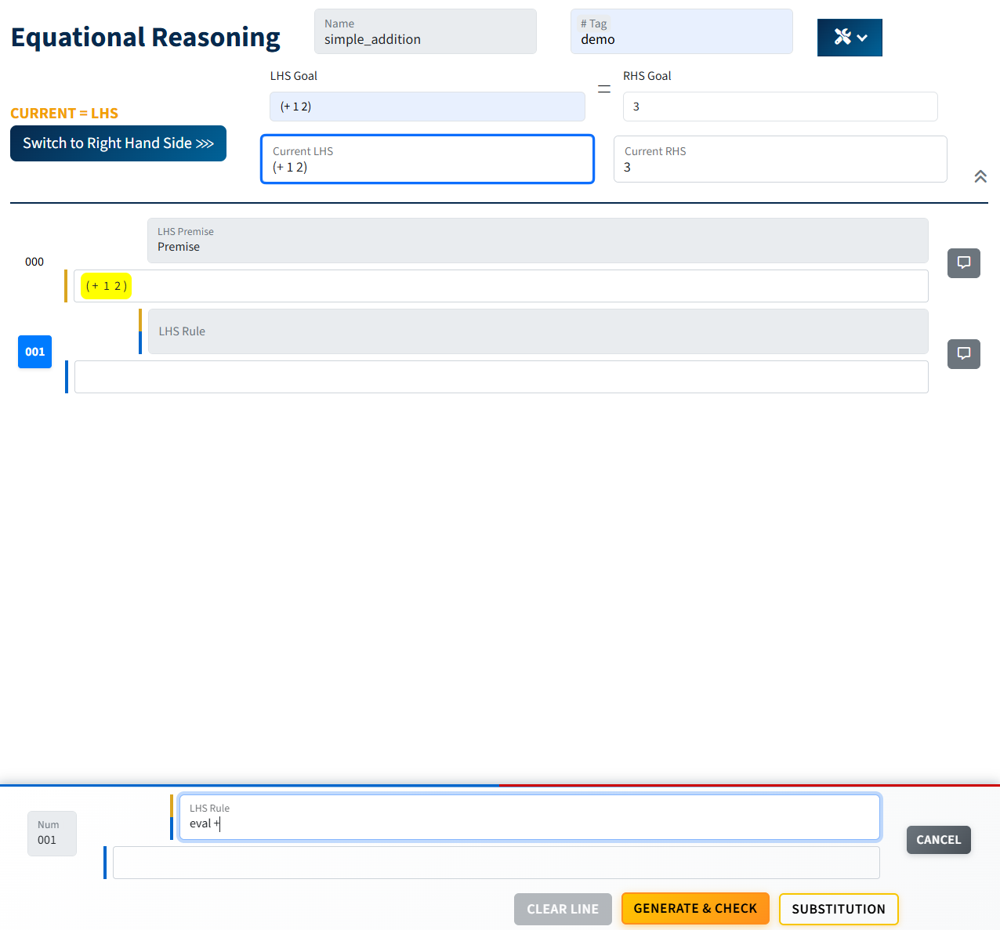
3. Click **Generate & Check** (or press Enter)

A new line should appear with `3` and the justification `(eval +)`.

If a step is invalid, a toast message explains the error (or a generic error, if your instructor has lowered support).

#### 2.3 Switch sides (when needed)

Some proofs need work on both sides. Use **Switch to Right Hand Side** / **Switch to Left Hand Side** to move between them. Each side has its own lines.
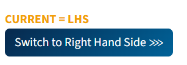

Example: to prove `(+ 2 3) = (+ 1 4)`, evaluate `+` on the LHS to get `5`, switch sides, then evaluate `+` on the RHS to get `5`.

#### 2.4 Check that the proof is complete

1. Keep applying rules until the last expression on the LHS is the same as the last expression on the RHS
2. Open **Proof Utilities** in the top right
3. Click **Check Current Proof**

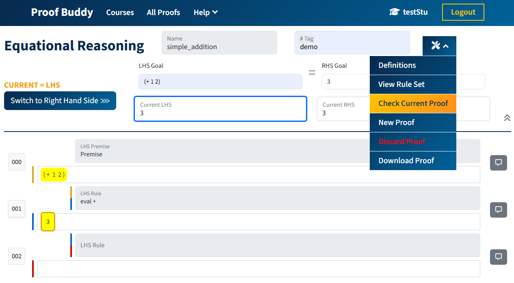

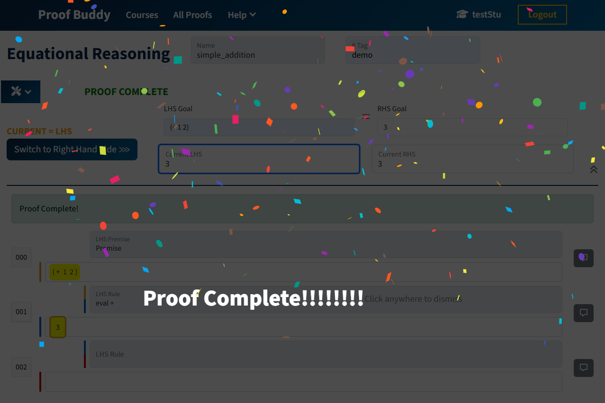

**Once Proof Buddy verifies that the proof is complete, it can be used later as a lemma.** See [§5 Lemmas](#5-lemmas).

Other footer buttons:
- **Clear Line**: removes the current non-premise line (you will be asked to confirm)
- **Substitution**: used for `rewrite math` and `rewrite logic` (see [§3](#3-types-of-rules))

Click a line number to bind the footer to that line before generating or clearing.

### 3. Types of Rules

Open **Proof Utilities** → **View Rule Set** at any time to see the on-screen reference.
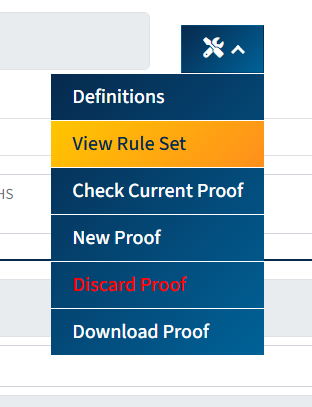

A rule is a short command plus a name. Highlight the matching subexpression first, then click **Generate & Check**.

- `eval <name>`: evaluate a built-in at the highlighted node (for example `eval +`, `eval first`, `eval if`, `eval null?`)
- `apply <name>`: unfold a definition, or apply a completed proof as a lemma (for example `apply length`, `apply consLen`)
- `rewrite <axiom>`: rewrite using a known identity (for example `rewrite first-cons`, `rewrite cons-first-rest`)
- `rewrite math`: symbolically simplify a math expression (opens **Substitution**)
- `rewrite logic`: simplify a logic expression (opens **Substitution**)
- `rewrite IH`: use the inductive hypothesis (**induction only**)

**Eval rules** include: `first`, `rest`, `cons`, `if`, `null?`, `zero?`, `and`, `or`, `not`, `implies`, `xor`, `+`, `-`, `*`, `=`, `<`, `>`, `<=`, `>=`, `quotient`, `remainder`, `expt`.

**Rewrite / apply identities** include: `cons-first-rest`, `first-cons`, `rest-cons`, `null?-cons`, `zero?+`, `-+`, plus definitions, lemmas, `IH`, `math`, and `logic`.

**On High Support**, parameter mapping for `apply` is optional (but if given it must be correct). **On Low Support**, you must type the mapping yourself, for example `apply consLen x↦x, B↦'(cons y null)`.

### 4. Definitions and Generics

**Definitions** are named functions you can use as rules. **Generics** are symbolic variables (for example `n` or `L`) used when a proof is about an unspecified value.

Open the window from **Proof Utilities** → **Definitions**.

#### 4.1 Built-in definitions

These are already available. You can enable or disable them, but you cannot edit or delete them:

- `(length L)` with type `LIST>INT`
- `(append L M)` with type `(LIST, LIST)>LIST`

Click **Enable Definition** on a definition before you use it in the current proof. Then apply it with `eval length` or `apply length` on a highlighted `(length …)` call.

#### 4.2 Create your own definition

1. Click **Create New Definition**
2. Fill in **Label** (for example `(double n)`), **Type** (for example `INT>INT`), and **Expression** (the function body)
3. Optionally add notes
4. Save, then **Enable Definition** on the proof

Leave **Expression** blank to declare a **generic** instead of a function.

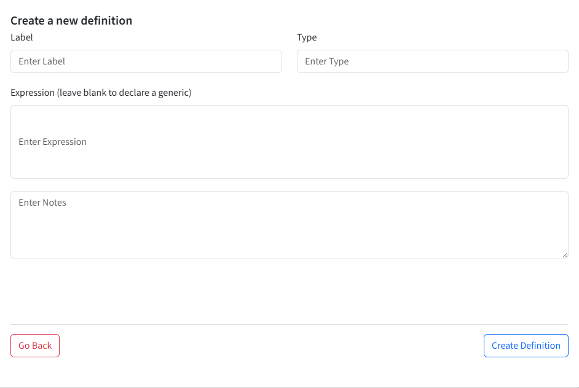

#### 4.3 Generics

A generic needs a **Label** and **Type** (for example `int`, `list`, `bool`). Enable it so the proof can treat that name as a symbolic value. Use **Enable Generic** / **Disable Generic** the same way as definitions.

Definitions and generics that are enabled when you start a proof are locked into that proof.

---

### 5. Lemmas

Any **named, completed, active** proof can be used as a lemma in a later proof. For the full walkthrough with screenshots, see [Lemma Guide: Use Instructions](../Lemma/LEMMA.md#1-use-instructions). Skip the Data Model and API sections.

1. Complete a proof and give it a name (see [§2.4](#24-check-that-the-proof-is-complete))
2. In another proof, highlight the expression that matches the lemma's LHS (premise)
3. Type `apply` followed by the lemma name, for example `apply consLen`
4. Click **Generate & Check**

If you forget the lemma name, open **All Proofs**, find it, then return to the proof you were working on.

- **On High Support**: parameter mapping is optional, but if given it must be correct (for example `apply consLen x↦x, B↦'(cons y null)`)
- **On Low Support**: parameter mapping must be typed in and must be correct

The highlighted expression must match the lemma premise (after mapping, if you provided one). If the step is invalid, a toast message states the error.

---

### 6. Induction Proofs

From the home page, choose **Induction** and click **Let's Begin**. An induction proof has a **base case** and a **leap** (inductive) case. Each case has its own LHS and RHS. You write steps the same way as in [§2](#2-starting-first-equational-proof).

#### 6.1 Fill in the start form

1. Enter a **Proof Name** and **# Tag**
2. Choose **Integers** or **Lists**
3. Fill in **IVar** (induction variable), **AVal** (anchor value), and **LVar** (leap variable)
4. Enter the **LHS Goal** and **RHS Goal** of the property you are proving
5. If **IH LHS** / **IH RHS** are shown and not filled in for you, enter the inductive hypothesis
6. Click **Start Induction Proof**

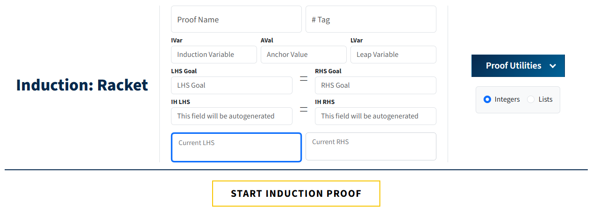

Typical integer values: **IVar** `n`, **AVal** `0`, **LVar** `k`. The leap variable must not be the same as the induction variable, and must not already appear in the goal. For integers, the anchor value must be a nonnegative integer. For lists, the anchor is usually `null`.

#### 6.2 Base case and leap case

After the proof starts:

- **CASE = BASE** or **CASE = LEAP** shows which case you are editing
- **Switch to Leap Case** / **Switch to Base Case** moves between them  
  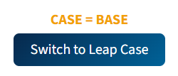
- **Switch Side** still switches LHS and RHS inside the current case
  

On the leap case, highlight the IH and type `rewrite IH` (induction only; this rule is not valid in equational proofs).

If the IH is not shown on the page, open **Proof Utilities** → **Show IH**.

#### 6.3 Check completion

Use **Proof Utilities** → **Check Current Proof**. Status is shown per case (**BASE COMPLETE** / **LEAP COMPLETE**). The whole induction proof is complete only when both cases are complete.

`rewrite IH` is only allowed on the leap case.

---

### 7. Saving and Reviewing Work

Proofs are saved as you work. Open **All Proofs** in the header to browse them. Use the dropdown to switch between **Equational Proofs** and **Induction Proofs**. You can search by name.

On each proof card:

- **Open Proof**: resume editing
- **Run Proof**: **Play Mode**: lines are revealed one at a time. Click **Continue** to show the next line. You cannot edit until you click **Cancel Play Mode** or reach the last line
- Trash icon: delete the proof (you will be asked to confirm)

**Proof Utilities** also includes:

- **New Proof**: leave the current proof and start a blank one
- **Discard Proof**: delete the current proof (not available when you are only reviewing someone else's work)
- **Download Proof**: save a `.json` file

On the **All Proofs** page, **Upload Proof from a Saved File** imports a downloaded `.json`. The file type must match the list you are viewing (equational vs induction).

#### 7.1 Comments

On each line, the comment (message) button opens two boxes. You edit **Student Comment**. The **Instructor Comment** box is read-only.

1. Click the message icon on the line
2. Read any **Instructor Comment** your instructor left
3. Type in **Student Comment** if you want to reply or leave a note
4. Click **Save** (or **Cancel** to close without saving)

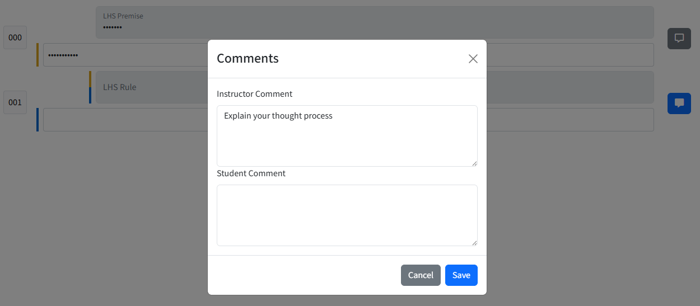

A filled (blue) message icon means that line already has a comment. An outline (gray) icon means it does not.

---

### 8. Courses and Assignments

For the classroom join flow, see [Course User Instructions: Student Operations](../Courses/COURSE_USER_INSTRUCTIONS.md#2-student-operations).

#### 8.1 Join a course

1. Click **Courses** in the header
2. Either **Accept** (or **Decline**) a pending invitation, or click **Join a Course** and paste the join code from your instructor

Join codes last **7 days**. Only **Active** courses appear for students. Click **Enter Course** to open a course you have joined.

#### 8.2 Work on an assignment

1. Open the course
  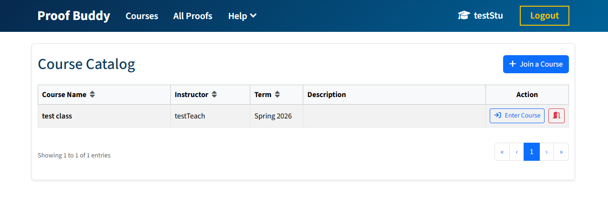
  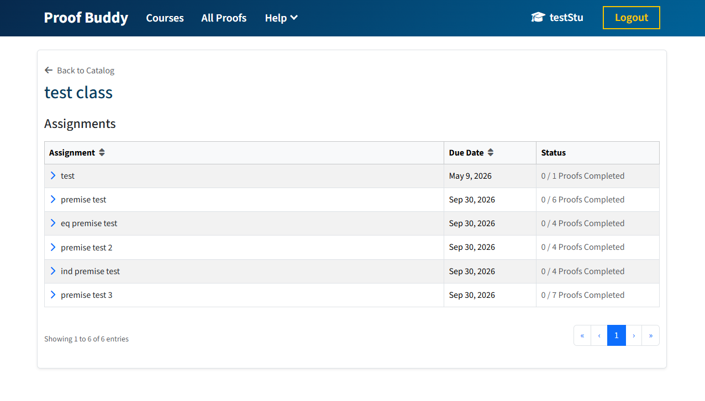
2. Click an assignment name to expand it and see its proofs
3. Click **Start Assignment** to make your own copy of that proof
4. Complete the proof (same editor as [§2](#2-starting-first-equational-proof) or [§6](#6-induction-proofs))
5. Use **Continue Assignment** to resume, or **View Submission** after it is complete

Statuses: 
- **Not Started**
  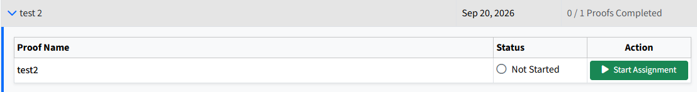
- **In Progress**
  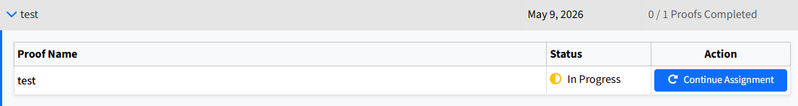
- **Completed**
  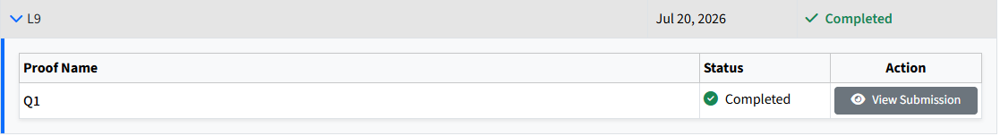

Assignment proofs can differ from proofs you start yourself:

- Some expressions, rules, or definition bodies may be hidden. Fill in the blank and click **Generate & Check**; the step is accepted only if it matches the stored answer
- You cannot mark the proof complete while anything is still hidden
- Support settings from your instructor change error messages, whether LHS/RHS and IH are shown, and whether you must type parameter mappings (see [§3](#3-types-of-rules))
- Your instructor can open your copy and leave comments on lines. Read and reply using the message button (see [§7.1](#71-comments))
- Completion the first time **Check Current Proof** succeeds is what is stored. If that happens after the due date, the work is marked **late**. Checking again later does not change that

---

### 9. FAQ

**I joined but I do not see the course.** 
- The course may not be marked Active, or the join code may have expired (7 days). Ask your instructor to activate the course or generate a new code.

**I signed up as the wrong account type.** 
- Student and instructor accounts are chosen at sign up and do not switch. Create the other kind of account if you need it.

**Start Assignment seems to do nothing.** 
- Wait for your personal copy to finish being created, then try **Continue Assignment** or refresh.

**I cannot check the proof complete.** 
- The last LHS and last RHS must be the same and on an assignment nothing may still be hidden.

**The IH is missing on an induction proof.**
- Under low support, open **Proof Utilities** → **Show IH** and enter it if it is not filled in.

**`rewrite IH` failed in an equational proof.**
- The inductive hypothesis is induction-only. Use it on the leap case of an induction proof.

**Generate & Check says I must enter a rule.** 
- Bind a line (click its number), highlight a subexpression, then type a rule from [§3](#3-types-of-rules).

**I forgot a lemma name.** 
- Open **All Proofs**, find the completed proof, then return to the proof you were writing.

**Play Mode will not let me edit.** 
- Click **Cancel Play Mode**, or **Continue** until every line is shown, then edit with **Open Proof** instead of **Run Proof**.

**I cannot type in Instructor Comment.**
- That box is for your instructor only. Use **Student Comment**, then **Save**.

