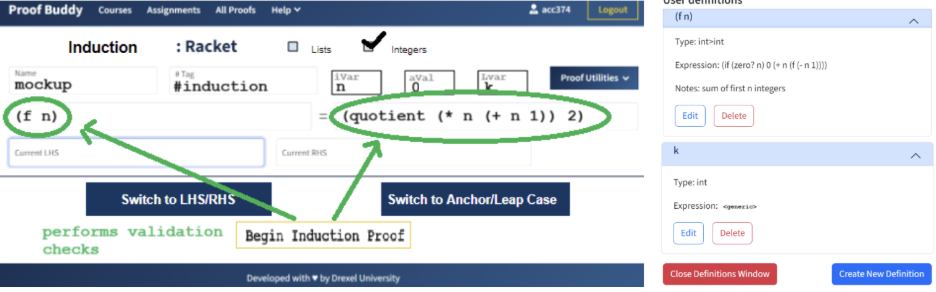

**Proof Buddy Sample Proof Mockup Tooltips**

**_What Feels "Off" About the UI for Equational Reasoning - Induction:_**

- The Proof Utilities button is right in the middle of the #tag and induction variable fields
- The Start Induction Proof button is hidden below the current left-hand side field
- The "Switch to LHS/RHS" and "Switch to Anchor/Leap Case" buttons are not visible
- The "User definitions" side pane is also not visible in my instance of the Proof Buddy app

The above figure illustrates what I mean in my four points mentioned above 

NOTE: This experience, as shown before, is the same for both students and teachers. 

Sample Tool Tips 

Because of the constraints outlined above, students nor professors will be able to reap the full benefits of Proof Buddy’s ERI feature in the classroom. If this feature was truly usable with a properly aligned UI, here is what the websites’ components would allow:  

The user would be able bind a line first to enable the arrow keys, and that it's the line ABOVE the bound line that arrow key is active in.  

 

Also, the highlights allow the users to group the terms in the expression to separate the operations.  

 

The current selection border is activated upon clicking ‘Check Current Proof’, which shows which parts of the left-hand side and right-hand side are correct and which need to be fixed. IVar is the induction variable, AVal is the anchor value, and LVar is the leap variable. An induction variable is a counter that increases or decreases with a set value. An anchor value, also called “base case”, is an initial value that holds true for the smallest possible number. And lastly, a leap variable is a placeholder variable that generalizes a proof. 

.png>)